# Gym Tracker: the Pokémon game you play by lifting

**A workout log where every set you save is an attack.** Log weight × reps × sets as usual, and your
Pokémon fights with them: wild Pokémon to catch, gym leaders to beat, a Pokédex to fill. Two full
campaigns, FireRed's Kanto and Emerald's Hoenn, run entirely on your real training.

### ▶ [Try it live: mateuszkrw-coder.github.io/gym-tracker-pokemon-game](https://mateuszkrw-coder.github.io/gym-tracker-pokemon-game/)

[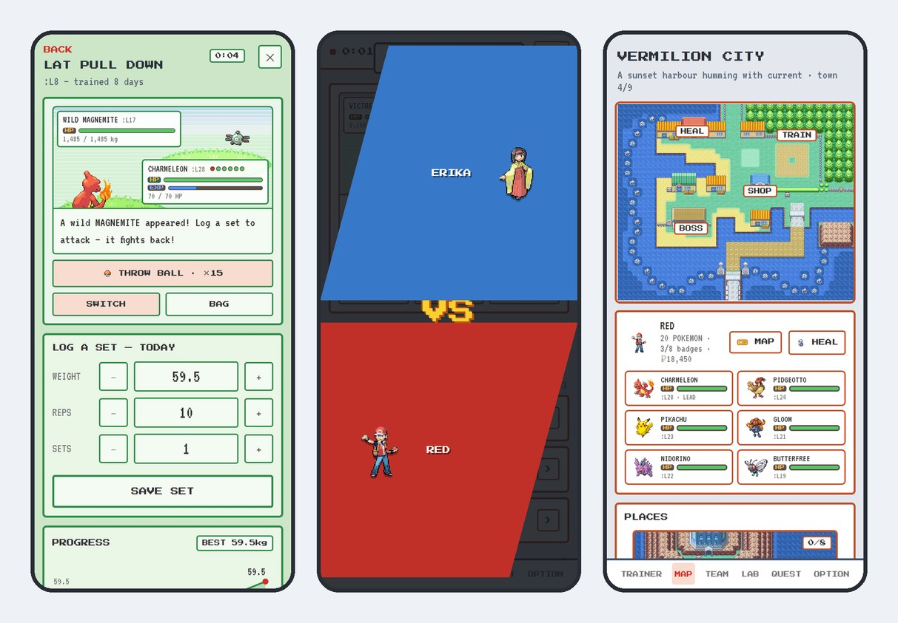](https://mateuszkrw-coder.github.io/gym-tracker-pokemon-game/)

Made for the phone: open the link in Safari on an iPhone and add it to your Home Screen, and it runs
full screen and offline like an app. It also works in any desktop browser. No account, no server:
everything stays on your device.

## Screenshots

<table>
<tr>
<td width="33%">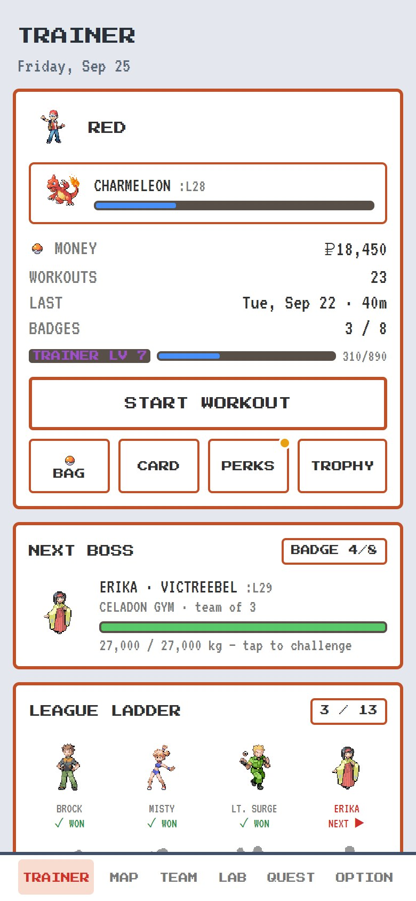 <b>Trainer page.</b> Your badges, money and trainer level, and the next gym leader waiting.</td>
<td width="33%">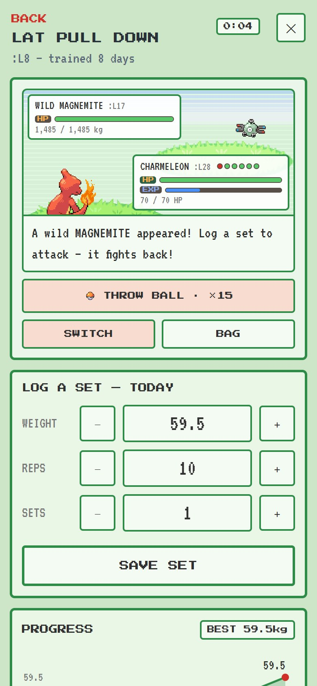 <b>Log a set.</b> The workout log and the battle share one screen. Saving the set attacks.</td>
<td width="33%">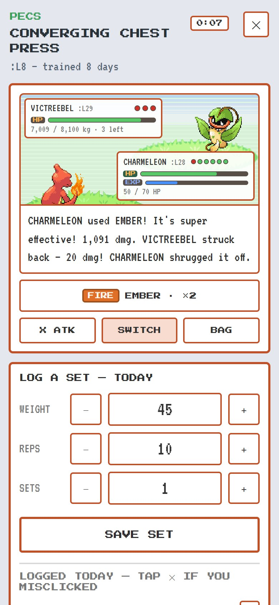 <b>Super effective!</b> Damage comes from effort: how close the set is to your own best on that lift.</td>
</tr>
<tr>
<td>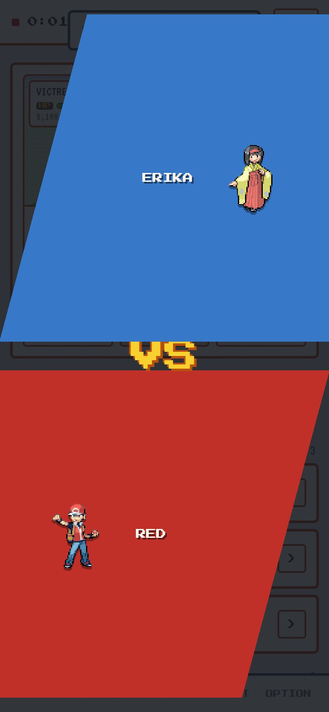 <b>Gym battles.</b> Thirteen bosses per region, each a whole workout long.</td>
<td>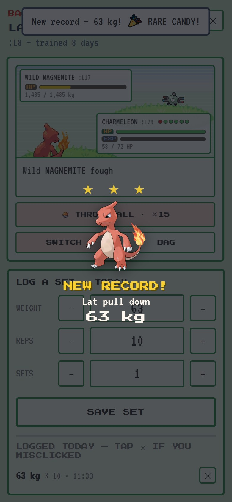 <b>New record.</b> Beat your best on a lift and the game celebrates, with a Rare Candy.</td>
<td>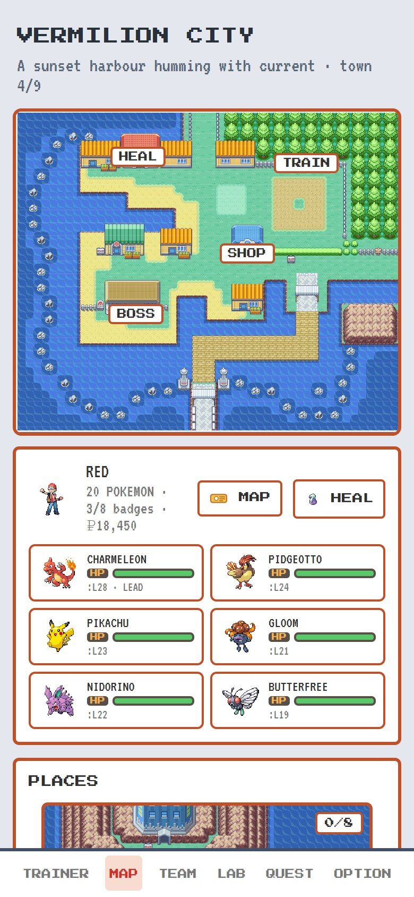 <b>Town map.</b> Nine Kanto towns on the official FireRed maps, each with its own wild Pokémon.</td>
</tr>
<tr>
<td>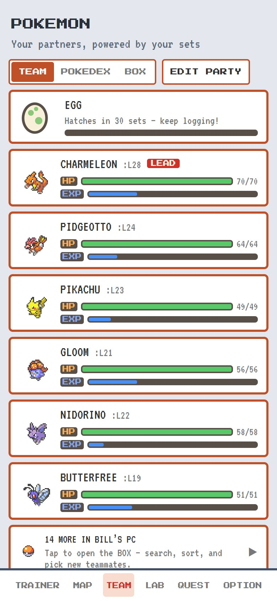 <b>Your team.</b> The six who fight for you, plus an egg that hatches as you log sets.</td>
<td>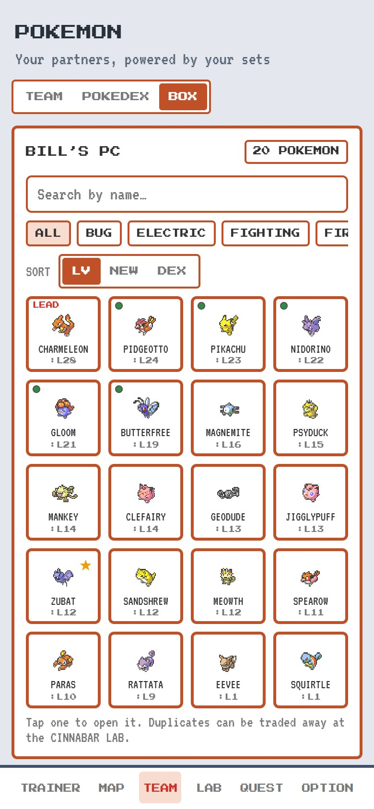 <b>Bill's PC.</b> Every Pokémon you've caught, searchable and sortable.</td>
<td>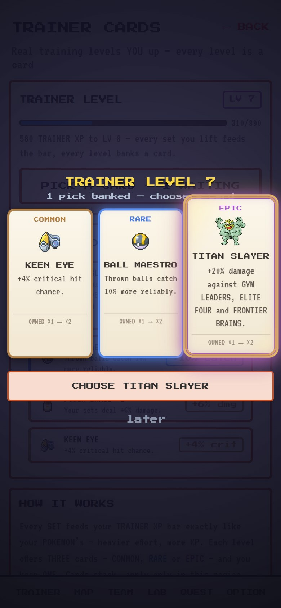 <b>Trainer cards.</b> Every trainer level lets you keep one of three perks.</td>
</tr>
<tr>
<td>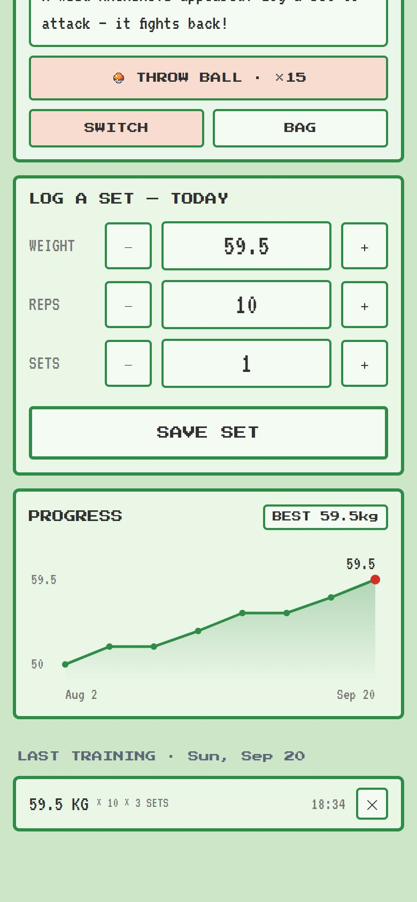 <b>Progress per exercise.</b> The tracker underneath: your history and personal best for every lift.</td>
<td>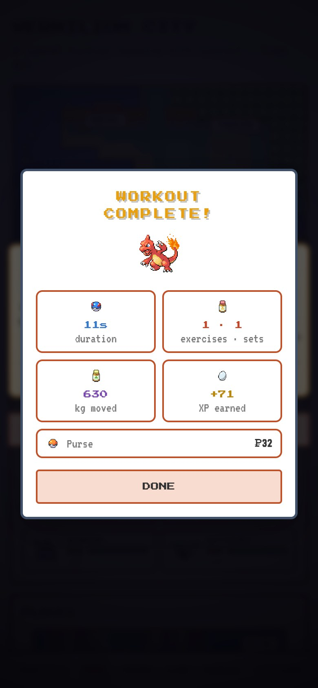 <b>Workout complete.</b> Duration, sets, volume moved and XP earned.</td>
<td>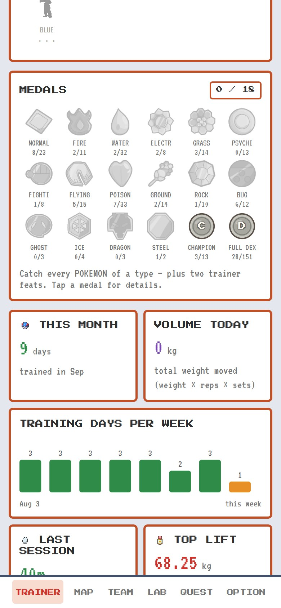 <b>Stats and medals.</b> Training days per week, this month's total, and type medals to collect.</td>
</tr>
</table>

## How it works

- **You train, the game follows.** It is a normal gym log first: muscle groups, exercises, weight ×
  reps × sets, a rest timer, notes per machine, history, charts and personal bests. The game never
  asks you to do anything but log your training.
- **Every set is an attack.** Start a workout and a wild Pokémon appears. Each set you save hits it,
  and it hits back. Weaken it, then throw a ball to catch it.
- **Effort, not raw kilos.** Damage and EXP scale with how close a set comes to *your* best on that
  exercise, so a 10 kg lateral raise at your limit hits as hard as a heavy leg press at yours.
- **Two campaigns.** Kanto has all 151 Pokémon, 8 gyms, the Elite Four and places like the Safari
  Zone, the Game Corner and Silph Co. After the Kanto Champion, the S.S. Tidal sails to Hoenn: the full
  Team Magma and Aqua story and all 202 Pokémon of the Emerald Pokédex.
- **Trainer levels and cards.** You level up too. Each level offers three cards (common, rare or
  epic) and you keep one: more damage, better catch rates, extra money, and more.
- **Rest days are safe.** Nothing is lost for a missed day, and streaks survive a rest day or two.

## Install on iPhone

1. Open the [live link](https://mateuszkrw-coder.github.io/gym-tracker-pokemon-game/) in **Safari**.
2. Tap the **Share** button (the square with an arrow).
3. Tap **Add to Home Screen**, then **Add**.
4. Launch it from the home screen icon. It runs full screen and works offline.

## Your data

- Everything lives only on your phone (`localStorage`), tied to the installed app.
- **If you delete the home screen icon, the data goes with it.** Use *OPTION → Export* now and then
  to keep a backup file, and *Import* to restore it.
- The installed app and a Safari tab have *separate* storage. Log your workouts in the installed app.

## Files

| File | Purpose |
|---|---|
| `index.html` | The whole app: HTML, CSS and JavaScript in one file, no build step |
| `sw.js` | Service worker that caches the app so it works offline |
| `manifest.webmanifest` | Home screen name, icons and full-screen display |
| `sprites/`, `map/`, `sounds/`, `fonts/`, `icons/` | Pokémon and trainer sprites, town maps and interiors, cries and move sounds, pixel fonts, app icons |
| `handover.md.txt` | Developer notes: architecture, data model, every game system, release history |
| `docs/screenshots/` | The images in this README |

## Updating the app

1. Edit the files and commit to `main`. GitHub Pages publishes the site from the repository root.
2. **Important:** in `sw.js`, bump the version string (for example `gym-tracker-v56` → `gym-tracker-v57`),
   or installed phones keep the old version.
3. Installed phones pick up the new version the next time the app is opened with internet. Close it
   fully and open it twice.

## Credits

A personal fan project, not affiliated with or endorsed by Nintendo, Game Freak or The Pokémon
Company. Pokémon names, sprites, artwork, maps and sounds belong to their respective owners. The
pixel fonts are Press Start 2P and VT323 (SIL Open Font License).
